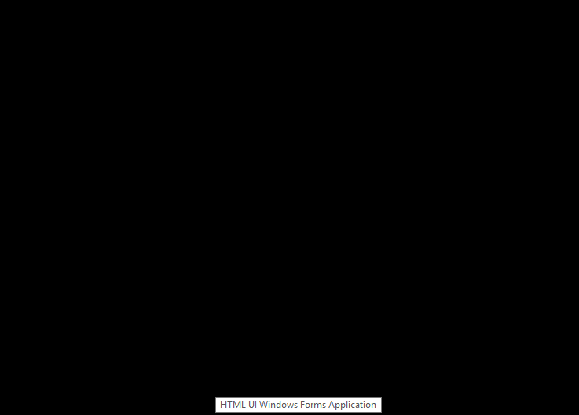

# HTML UI Windows Forms Application - Project Template

## What's this?

This is sample code of "HTML UI Windows Forms Application".

"HTML UI Windows Forms Application" is, core implementations are based on classical Windows Forms,
 but implementations of user interface are powered by Web technology.
 
Entire of main form is covered by Web browser component, and the application provide HTTP server it self based on OWIN self hosting technic.

## Download sample application - Tiny Text Editor

The sample appication zip archived can download [here](releases/download/1st-commit/HTMLUIWinFormsApp.Sample.-.Tiny.Text.Editor.zip).

## license

[MIT license](LICENSE)
